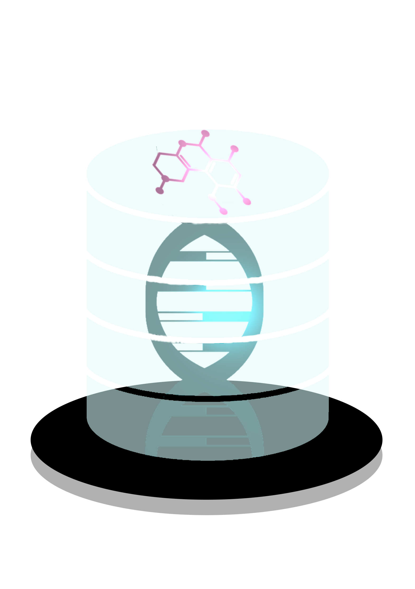

# BioDM: A fast and RESTful Data Management framework

<p align="center"></p>

---

**Introduction Presentation**: <a href="https://www.overleaf.com/read/wxpdnptnkpsy" target="_blank">https://www.overleaf.com/read/wxpdnptnkpsy</a> 

**Source Code**: <a href="https://github.com/bag-cnag/biodm" target="_blank">https://github.com/bag-cnag/biodm</a>

**Documentation**: <a href="https://bag-cnag.github.io/biodm/" target="_blank">https://bag-cnag.github.io/biodm/</a>

---

BioDM is a fast, modular, stateless and asynchronous REST API framework with the following core features:

- Provide standard HTTP REST-to-CRUD endpoints from **developper provided** entity definitions:
  - _[SQLAlchemy](https://github.com/sqlalchemy/sqlalchemy/)_ tables
  - _[marshmallow](https://github.com/marshmallow-code/marshmallow)_ schemas

- Inter-operate services ecosystem:
  - Permissions leveraging _Keycloak_
  - Storage leveraging _S3_ protocol
  - Jobs & Visualization leveraging _Kubernetes_ cluster

-> Act as an API gateway and log relevant data.

- Also sets up essentials:
  - Liveness endpoint
  - Login and token retrieval system
  - OpenAPI schema generation through [apispec](https://github.com/marshmallow-code/apispec)

## Quickstart
### Install
```bash
pip3 install git+https://github.com/bag-cnag/biodm
```

### Run app
To run the API you will also need an ASGI server, **i.e.** uvicorn+uvloop by default:
```bash
pip3 install uvicorn uvloop
```
OR
```bash
pip3 install -r src/requirements/dev.txt
```

Then you may run our `example` after populating  `src/example/.env` with your desired configuration:
```bash
cd src/example/
python3 src/example/app.py
```

Alternatively, if your goal is simply to run `example` locally
you may use the following command beforehand in order to deploy the development stack:

```bash
docker compose -f compose.yml up --build -d
```

This stack comes with an interactive ``swagger-ui`` visitable at ``http://localhost:9080/``
once the server is running.

## About

Developed at CNAG

## Contributing

No contributing policy yet. However, issues and pull requests are welcome.

## Licence

GNU/GPLv3
